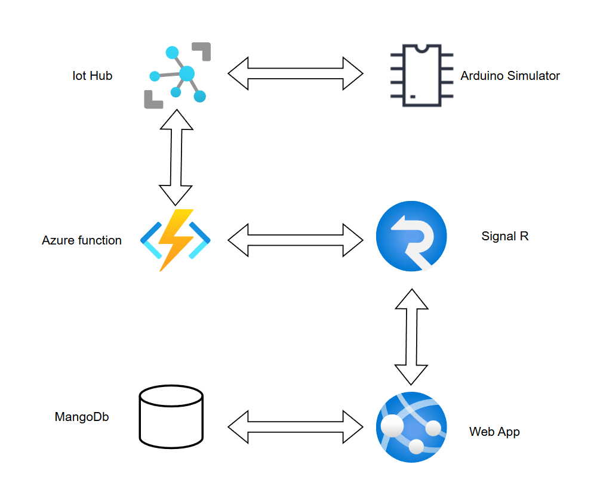

<!-- Permet que ca ne s'affiche pas dans la table des matieres--> 
<!-- omit in toc -->
# Smart Home Technical Documentation

<!-- omit in toc -->
# Table of Contents
 

- [1. Executive Summary](#1-executive-summary)
  - [1.1. Purpose](#11-purpose)
  - [1.2. Scope](#12-scope)
  - [1.3. Audience](#13-audience)
- [2. System Overview](#2-system-overview)
  - [2.1. Problem Statement](#21-problem-statement)
  - [2.2. Solution Highlights](#22-solution-highlights)
- [3. Architecture Overview](#3-architecture-overview)
  - [3.1. Logical Architecture](#31-logical-architecture)
  - [3.2. Components Description](#32-components-description)
- [4. Detailed Component Design](#4-detailed-component-design)
  - [4.1. IoT Devices](#41-iot-devices)
  - [4.2. Azure IoT Hub](#42-azure-iot-hub)
  - [4.3. Azure Functions](#43-azure-functions)
  - [4.4. SignalR Service](#44-signalr-service)
  - [4.5. Web Application](#45-web-application)
- [6. Data Flow](#6-data-flow)
  - [6.1. End-to-End Data Flow](#61-end-to-end-data-flow)

---
  
## 1. Executive Summary
### 1.1. Purpose

The Smart Home IoT web application provides an **end-to-end IoT solution** enabling centralized control of devices (e.g., lights, heaters, speakers) in a simulated smart home environment. It ensures real-time updates between the **Arduino simulator** and an user-friendly **Angular-based web interface**, powered by Azure infrastructure.

- **Key objectives** :
  - **Real-time device control**: Allow users to turn room devices (lights, heaters, speakers, etc.) on and off through the web interface.
  - **Bidirectional synchronization**: Ensure that changes in device states in the Arduino simulator are reflected in real time on the web interface, and vice versa.
  - **Room and device management**: Extend functionality to allow adding new rooms and devices dynamically.
  - **Scalability**: Lay the groundwork for a flexible and extensible system that can support more complex scenarios in smart home automation.

### 1.2. Scope

- **In-Scope**:
  - Web app for controlling devices (turning them on/off).
  - Bidirectional synchronization between the web app and the Arduino simulator.
  - Managing rooms and devices from the web app.
  - Testing within an Arduino simulation environment.
- **Out-of-Scope**:
  - Real-world IoT device testing (e.g., physical sensors).
  - Advanced features such as energy monitoring, battery status, and real-time alerts.

### 1.3. Audience
This documentation is intended for:
- **Developers**:
  - Frontend developers working on the Angular web app.
  - Backend developers working with C#, Azure Functions and SignalR.
  - IoT firmware developers working with the Arduino simulator.
- **Solution Architects**:
  - Responsible for ensuring scalability, security, and architecture alignment.
- **Scrum Masters**:
  - Facilitating team collaboration, sprint planning, and retrospective discussions. And tracking deliverables, milestones, and team progress
- **Product Owner**:
  - Representing stakeholders and ensuring the project meets business requirements.
- **End-Users**:
  - Individuals or organizations testing or exploring basic smart home automation.

---

## 2. System Overview
### 2.1. Problem Statement

- **Centralizing IoT Devices**:
   - Provide a solution to connect and centralize data from various IoT devices in a single interface.
   - Ensure a consolidated, real-time view of the collected information for optimized management.
  
- **Managing Connected Devices**:
    - Offer functionalities for:
      - Adding, removing, and configuring devices and rooms.
      - Monitoring device status (connectivity, battery, operational state, etc.).
      - Updating firmware and device configurations remotely.

### 2.2. Solution Highlights
  1. **Real-Time Updates with SignalR**:
   - **Challenge**: Users need to see device state changes and control devices in real time without refreshing the interface.
   - **Solution**:
     - Integration of **Azure SignalR** enables seamless bidirectional communication between the backend and frontend.
     - Updates to device states in the simulator or web app are reflected instantly on both ends, ensuring consistency.

  2. **Device Integration via Azure IoT Hub**:
   - **Challenge**: Establish secure and reliable communication between the Arduino simulator and the web application.
   - **Solution**:
     - **Azure IoT Hub** acts as the central hub for managing device connectivity and communication.
     - It supports various IoT protocols, ensuring compatibility and reliable data transmission.

  3. **Serverless Backend Using Azure Functions**:
   - **Challenge**: Process and manage data efficiently without relying on heavy infrastructure.
   - **Solution**:
     - **Azure Functions** provide a lightweight, event-driven backend that processes device data and implements business logic.
     - The serverless architecture ensures scalability and cost efficiency, automatically adapting to workload changes.

---

## 3. Architecture Overview
### 3.1. Logical Architecture
**The high-level architecture of the application**.

The system architecture follows this flow:
1. **Devices** in the Arduino simulator send state updates (e.g., on/off) to **Azure IoT Hub**.
2. **Azure IoT Hub** forwards data to **Azure Functions** for processing.
3. **Azure Functions** executes business logic and sends real-time updates to the **SignalR** Service.
4. **SignalR** ensures real-time communication with the Angular **frontend**.
5. The **web app** allows users to send commands with **REST API's** to **the back-end**.
6. The **back-end** updates the **MongoDB** and propagates back to the simulator using SignalR.

### 3.2. Components Description
High-Level Description of IoT Solution Components
- **IoT Devices (Edge Devices)**
  - **Description**:
  IoT devices, such as sensors and actuators, collect and send telemetry data (e.g., temperature, motion, or humidity) to the cloud. These devices can also receive commands from the cloud for tasks like toggling power, updating configurations, or performing specific actions.
  - **Role in the Solution**:
  Acts as the data source and point of control for real-world environments, enabling interaction with physical systems.

- **Azure IoT Hub**
  - **Description**:
  A cloud-hosted service that facilitates secure, bi-directional communication between IoT devices and the backend system. It supports various protocols (e.g., MQTT, HTTP) and ensures reliable device authentication and message delivery.
  - **Role in the Solution**:
  Central hub for managing device connectivity, data exchange, and communication with the backend.

- **Azure Functions**
  - **Description**:
  A serverless computing platform that executes event-driven code in response to triggers, such as incoming telemetry data from the IoT Hub. Azure Functions processes this data, applies business logic, and triggers additional actions like storing data in a database or sending updates.
  - **Role in the Solution**:
  Acts as the brain of the system, processing data and orchestrating the flow between components like the database, SignalR, and web app.

- **SignalR Service**
  - **Description**:
  A real-time communication service that facilitates instant updates from the backend to the web application. It allows data to be pushed directly to the user interface without needing a page refresh.
  - **Role in the Solution**:
  Ensures real-time updates for users, such as live telemetry readings, device state changes, or alert notifications.

- **Web Application**
  - **Description**:
  A user-facing dashboard, typically built using frameworks like Angular, that provides an interface for monitoring devices, viewing data, and controlling the IoT devices. It connects to the SignalR service for real-time updates and interacts with the backend for actions like retrieving historical data or sending commands.
  - **Role in the Solution**:
  Serves as the control center for users, offering an intuitive and responsive way to interact with the IoT system.

--- 

## 4. Detailed Component Design
### 4.1. IoT Devices
- Protocols: MQTT, AMQP, or HTTP.
- Data format: JSON.

### 4.2. Azure IoT Hub
- Device provisioning and authentication.
- Message routing and telemetry ingestion.

### 4.3. Azure Functions
- Trigger types: IoT Hub events, HTTP requests.
- Input/Output bindings: Event Hub.

### 4.4. SignalR Service
- Real-time broadcasting.
- Scaling and connection limits.

### 4.5. Web Application
- Frontend: Angular with Typescript and Model-View-Controller pattern. The REST API's to communicate with the back-end are in the Services, where there is also a SignalR service.
- Integration: REST APIs and SignalR in the C# back-end.

## 6. Data Flow
### 6.1. End-to-End Data Flow

1. **IoT Devices**:
   - Collect telemetry data (e.g., device status, environmental readings).
   - Transmit data to the **Azure IoT Hub** using supported protocols.

2. **Azure IoT Hub**:
   - Receives and manages incoming data from IoT devices.
   - Routes data to **Azure Functions** for processing.

3. **Azure Functions**:
   - Executes event-driven backend logic.
   - Triggers updates or stores processed data.

4. **SignalR Service**:
   - Distributes real-time updates to the **Web Application**.
   - Sends user commands back to the IoT devices.

5. **Web Application**:
   - Provides a dashboard for users to monitor and control devices.
   - Sends user commands to **Azure IoT Hub** via REST APIs.